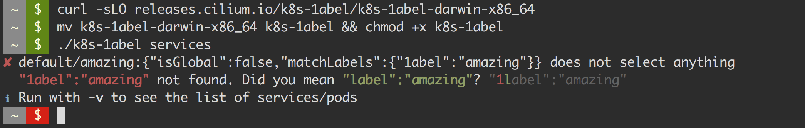

# 1abel - Kubernetes YAML/JSON survival kit

> The tool that helps you survive painful YAML days.

Kubernetes uses label selectors to create references between different
resources such as services referring to pods or deployments. All references are
losely coupled using label names. Typos can lead to stale references between
resources and are very hard to find.

1abel ("label") validates all [LabelSelector] in Kubernetes resources such as
[Services], and automatically points out label references that cannot be
associated with a target pod or target deployment.

## Example - Validate all service references

## Supported Kubernetes Resources

| Source Resource       | Target Resources                                           |
| --------------------- | ---------------------------------------------------------- |
| [Service]             | Pod (and all higher level constructs such as [Deployments] |
| [CiliumNetworkPolicy] | Pod (and all higher level constructs such as [Deployments] |

## Requirements

- [`kubectl`](https://kubernetes.io/docs/tasks/tools/install-kubectl/) must be
   installed in `$PATH`.

## Build & Development Requirements

Install [yarn], then

    yarn

to install dependencies, then run

    yarn test -h

to execute the CLI.

    yarn build

to build all binaries.

[LabelSelector]: https://kubernetes.io/docs/concepts/overview/working-with-objects/labels/
[Services]: https://kubernetes.io/docs/concepts/services-networking/service/
[Service]: https://kubernetes.io/docs/concepts/services-networking/service/
[Deployments]: https://kubernetes.io/docs/concepts/workloads/controllers/deployment/
[CiliumNetworkPolicy]: http://cilium.readthedocs.io/en/latest/kubernetes/policy/#ciliumnetworkpolicy
[yarn]: https://yarnpkg.com/lang/en/docs/install/
