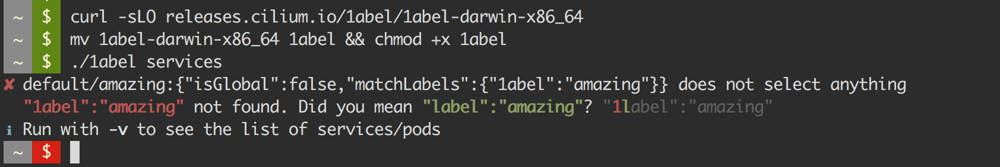

# k8s-1abel - Kubernetes YAML/JSON survival kit

> The tool that helps you survive painful YAML days.

Kubernetes uses label selectors to create references between different
resources such as services referring to pods or deployments. All references are
loosely coupled using label names. Typos can lead to stale references between
resources and can be very hard to find.

k8s-1abel ("k8s-label") validates all [LabelSelector] in Kubernetes resources
such as [Services], and automatically points out label references that cannot
be associated with a target pod or target deployment.

## Example - Validate all service references

## Installation & Usage

    $ curl -sLO releases.cilium.io/k8s-1abel/k8s-1abel-darwin-x86_64
    $ mv k8s-1abel-darwin-x86_64 k8s-1abel && chmod +x k8s-1abel
    $ ./k8s-1abel services
    ✘ default/amazing:{"isGlobal":false,"matchLabels":{"1abel":"amazing"}} does not select anything
      "1abel":"amazing" not found. Did you mean "label":"amazing"? "1label":"amazing"
    ℹ Run with -v to see the list of services/pods

## Supported Kubernetes Resources

| Source Resource       | Target Resources                                           |
| --------------------- | ---------------------------------------------------------- |
| [Service]             | Pod (and all higher level constructs such as [Deployments] |
| [CiliumNetworkPolicy] | Pod (and all higher level constructs such as [Deployments] |

## Requirements

- [`kubectl`](https://kubernetes.io/docs/tasks/tools/install-kubectl/) must be
   installed in `$PATH`.

## Build & Development Requirements

Install [yarn], then

    yarn

to install dependencies, then run

    yarn test -h

to execute the CLI.

    yarn build

to build all binaries.

[LabelSelector]: https://kubernetes.io/docs/concepts/overview/working-with-objects/labels/
[Services]: https://kubernetes.io/docs/concepts/services-networking/service/
[Service]: https://kubernetes.io/docs/concepts/services-networking/service/
[Deployments]: https://kubernetes.io/docs/concepts/workloads/controllers/deployment/
[CiliumNetworkPolicy]: http://cilium.readthedocs.io/en/latest/kubernetes/policy/#ciliumnetworkpolicy
[yarn]: https://yarnpkg.com/lang/en/docs/install/
